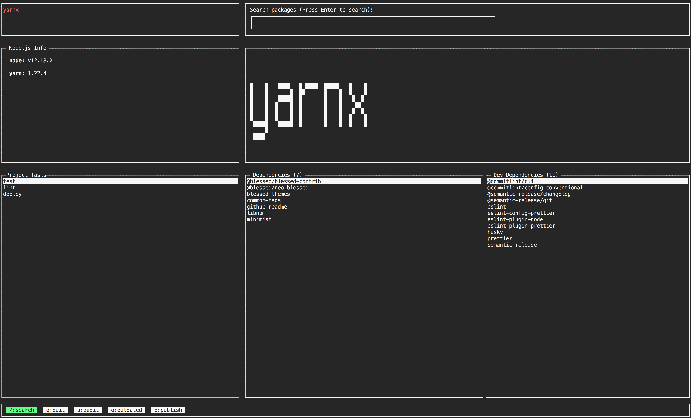
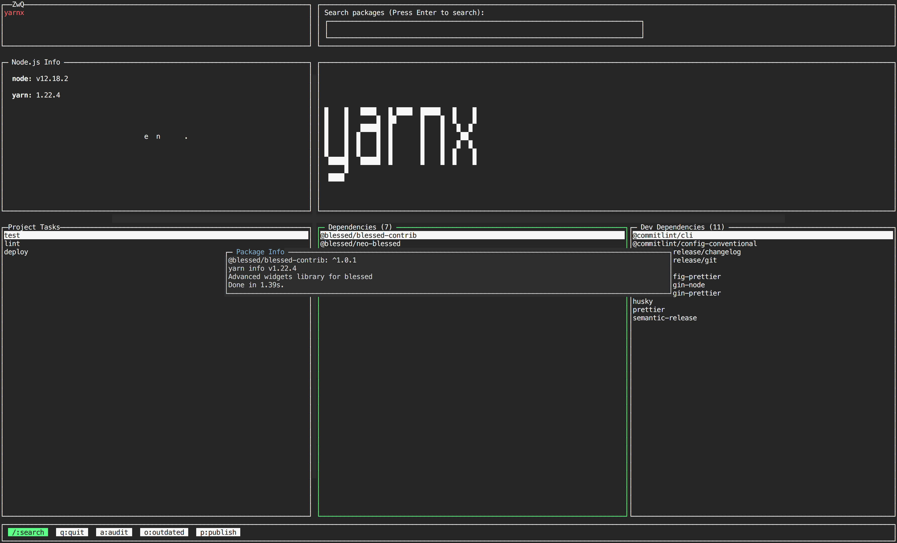
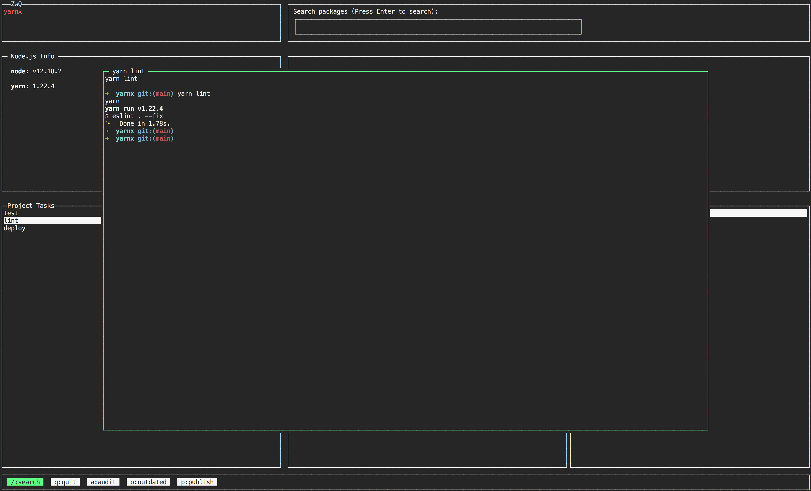
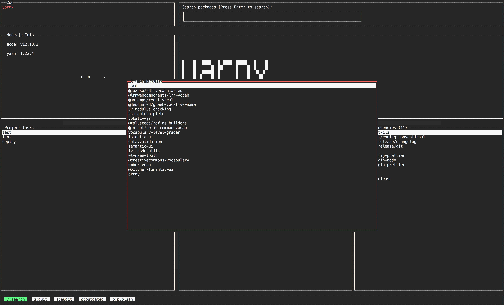

# yarnx


[](https://github.com/semantic-release/semantic-release)
[](https://npmjs.org/package/@terminal-junkies/yarnx "View this project on npm")

An advanced CLI interface for [yarn](https://classic.yarnpkg.com/en/)

Features:
- Search packages from the terminal
- Run your project tasks with yarn
- Install a selected package with one keystroke
- Mnemonic key-bindings for installing packages


## Install

```
yarn global add @terminal-junkies/yarnx
```

## Usage

```
yarnx
```

## Screenshots
[](https://asciinema.org/a/364635)


### Home


### Dependency Info


### Tasks


### Search


### Package Page


## FAQS

### How do I quit this thing?
You can press `q` to quit the program at any time.

### How do I scroll the package readme?
You can use `up` and `down` arrow keys to scroll. And you can also make use of vim navigation keys like `j,k,gg,G` to scroll.

### How can I see the keyboard shortcuts for navigating?
The keyboard shortcuts will be displayed at the bottom of the screen for each page.

### How do I close the project task terminal after the task is completed?
Press `Esc` to close the terminal window for project tasks.

### Does it support vi/vim navigation keys in the lists?
Yes. You can use j,k,gg,G,l and /
